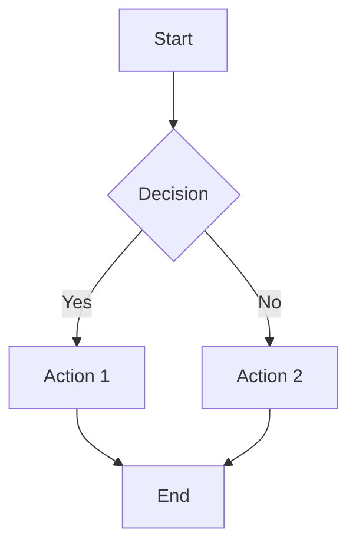
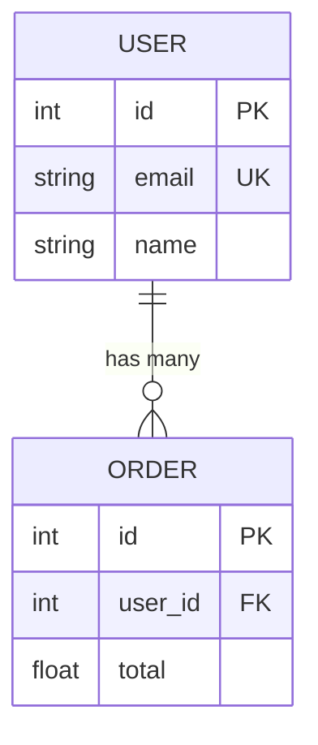
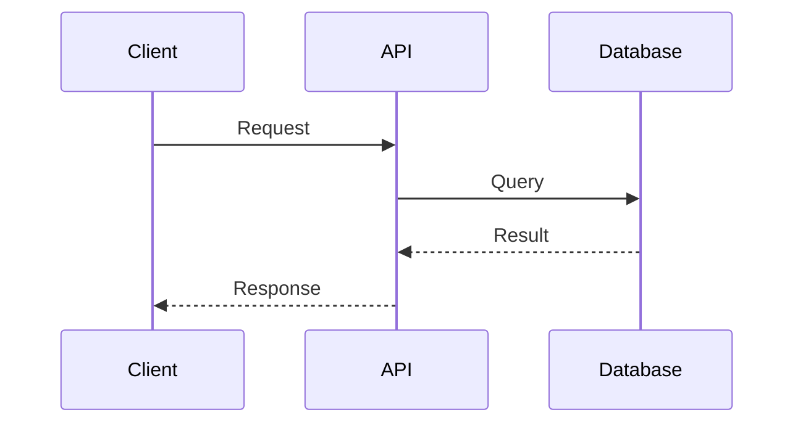

# /analyze/data/visualize

Generate diagrams and visualizations from code and architecture analysis.

## Context

Use this command to create visual representations of code structure, data flows, and system architecture:

- Target: `$ARGUMENTS` (code pattern, function, or architectural element to visualize)
- Current directory: !`pwd`
- Code files: !`fd "\.(go|ts|js)$" . | wc -l | tr -d ' '` found

## Usage

```bash
/analyze/data/visualize "authentication flow"
/analyze/data/visualize "./src/payment.go:ProcessPayment"
/analyze/data/visualize "./models" --type=database
```

## Your Task

**STEP 1: Analyze Target and Determine Visualization Type**

IF $ARGUMENTS contains specific function/method:
- FOCUS on code flow visualization
- GENERATE function flowcharts with decision points
- ANALYZE control flow and error handling paths

ELSE IF $ARGUMENTS contains database/model patterns:
- GENERATE Entity Relationship Diagrams
- MAP table relationships and constraints
- ANALYZE schema dependencies

ELSE IF $ARGUMENTS contains API/service patterns:
- GENERATE sequence diagrams for request/response flows
- MAP service interactions and dependencies
- ANALYZE async operations and error scenarios

ELSE:
- DETERMINE optimal visualization based on code structure
- CREATE comprehensive diagram suite for system overview

**STEP 2: Generate Appropriate Diagrams**

FOR EACH identified component:
- USE Glob to find relevant source files
- READ key implementation files
- EXTRACT structural information and relationships
- CREATE Mermaid.js diagrams for compatibility

**STEP 3: Create Structured Output**

WRITE diagrams to appropriate files:
- `docs/diagrams/` directory for project documentation
- INCLUDE explanatory text with source code references
- ADD context and usage notes for each diagram
- ENSURE diagrams render in common markdown tools

**STEP 4: Validate and Document**

- VERIFY diagram syntax is valid Mermaid.js
- TEST rendering in markdown preview
- CREATE index file linking all generated diagrams
- ADD README with viewing instructions

## Expected Output

```markdown
# System Visualization: [Target Name]

## Architecture Overview
[Generated Mermaid diagram showing system structure]

## Data Flow Analysis
[Sequence diagrams showing interactions]

## Implementation Details
- Source files analyzed: [list]
- Key patterns identified: [list]
- Dependencies mapped: [list]

## Diagram Files Generated
- `docs/diagrams/flowchart.md` - Code flow visualization
- `docs/diagrams/sequence.md` - API interaction flows
- `docs/diagrams/erd.md` - Database schema relationships
```

## Diagram Types

### Flowcharts


### Entity Relationship Diagrams


### Sequence Diagrams


## Examples

### Example 1: Function Flow
`/analyze/data/visualize "./src/payment.go:ProcessPayment"`

Generates flowchart showing payment processing logic, decision points, and error handling.

### Example 2: Database Schema
`/analyze/data/visualize "./models"`

Creates ERD showing table relationships, foreign keys, and constraints.

### Example 3: API Flow
`/analyze/data/visualize "./api/handlers"`

Produces sequence diagrams for request/response flows and service interactions.

**IMPORTANT**: Focus on clear, readable diagrams that accurately represent code structure. Ensure all diagrams use valid Mermaid.js syntax for maximum compatibility.