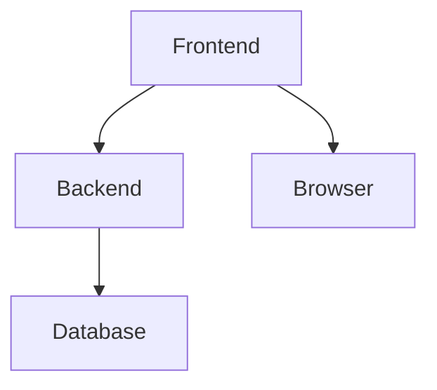
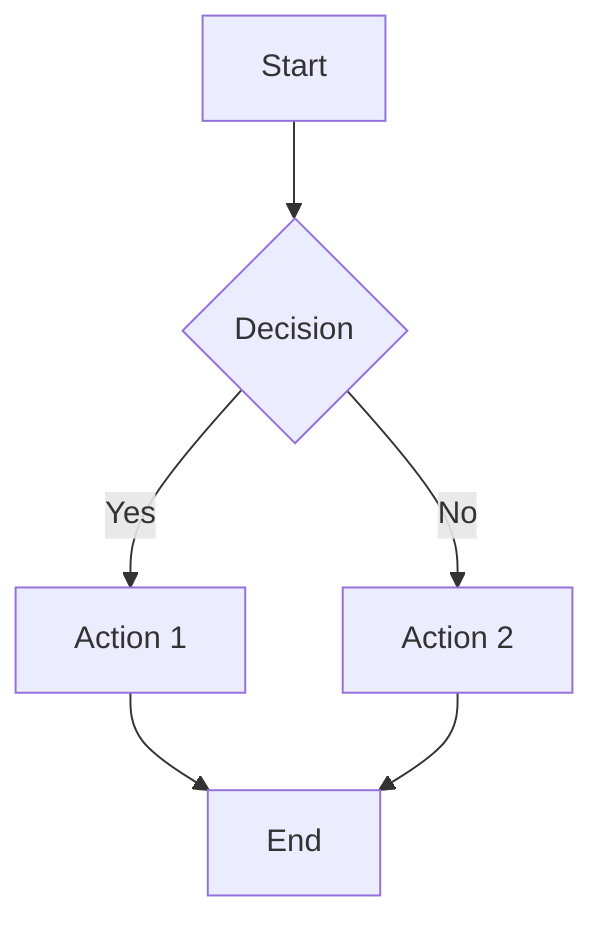
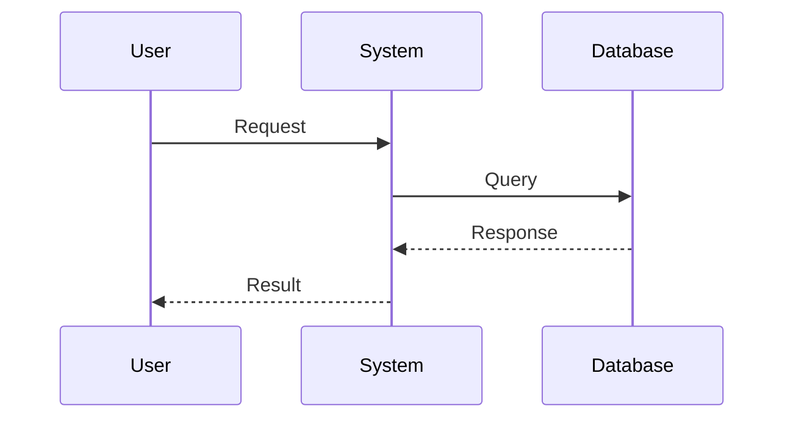
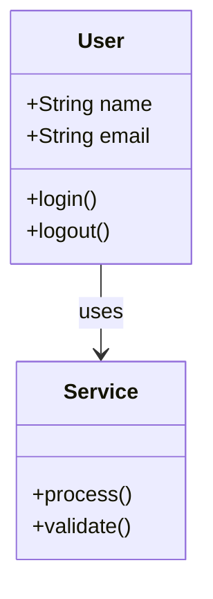
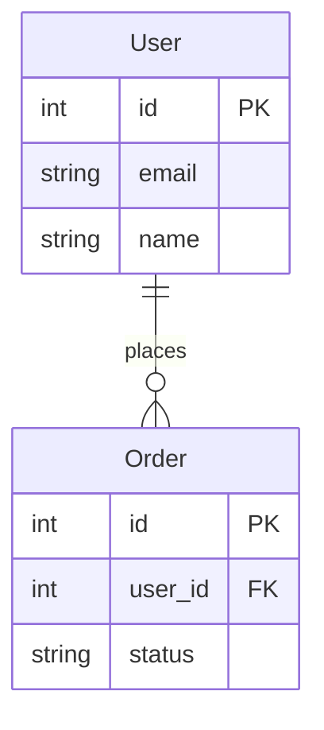

## Context

- Current directory: !`pwd`
- Project files: !`fd --type f | head -10`
- Existing docs: !`fd docs --type d`
- Target: $ARGUMENTS

## Your Task

Generate architecture, flow, and relationship diagrams from code structure and documentation using Mermaid syntax only. All diagrams will be placed in `docs/diagrams/` directory.

**STEP 1: Analyze Codebase**

- READ package.json, README.md, and main configuration files
- GLOB for source files: `**/*.{js,ts,jsx,tsx,py,go,rs}`
- IDENTIFY key components, services, and modules
- MAP dependencies and relationships

**STEP 2: Create Diagram Directory**

- CHECK if `docs/diagrams/` exists
- CREATE directory if needed: `mkdir -p docs/diagrams`

**STEP 3: Generate Diagram**

CHOOSE diagram type based on $ARGUMENTS or auto-detect:

**Architecture Diagram** - System overview
**Flow Diagram** - Process flows
**Component Diagram** - Component relationships
**Sequence Diagram** - Interaction flows
**Class Diagram** - Object relationships
**ERD** - Database schema

**STEP 4: Create Diagram File**

- WRITE diagram to `docs/diagrams/{type}-diagram.md`
- INCLUDE overview, key components, and relationships
- USE Mermaid syntax only

## Mermaid Diagram Templates

### Architecture Diagram



### Flow Diagram



### Sequence Diagram



### Class Diagram



### Entity Relationship Diagram



## Output Format

Each diagram file will include:

````markdown
# {Type} Diagram

## Overview

Brief description of what the diagram shows

## Diagram

```mermaid
[Mermaid diagram code]
```
````

## Key Components

- **Component A**: Description
- **Component B**: Description
