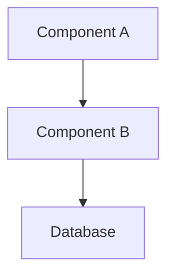

# /spec-design

Generate technical design document based on approved requirements.

## Context

- Feature name: $ARGUMENTS
- Current directory: !`pwd`
- Existing specs: !`ls .claude/specs/ 2>/dev/null || echo "No specs found"`
- Design template: !`ls ~/.claude/templates/design-template.md 2>/dev/null || echo "No template"`
- Project structure: !`fd . -type f -name "*.json" -o -name "*.js" -o -name "*.ts" -o -name "*.go" | head -10 2>/dev/null || echo "No code files found"`

## Usage

```
/spec-design [feature-name]
/spec-design user-authentication
```

## Your Task

**STEP 1: Validate Prerequisites**

IF no feature-name provided:

- LIST available specs in `.claude/specs/` directory
- ASK user to specify which spec to work on
- EXIT with usage guidance

ELSE:

- VALIDATE spec directory exists at `.claude/specs/{feature-name}/`
- CHECK requirements.md exists and is complete
- LOAD requirements.md for design context
- VALIDATE requirements are approved (check for approval marker)

**STEP 2: Research Existing Codebase**

- USE Task tool to analyze project structure and patterns
- IDENTIFY existing architecture and frameworks
- FIND similar components or features for reference
- ANALYZE config files for dependencies and configurations
- DETERMINE integration points and dependencies

**STEP 3: Load Design Template**

- READ design template from `~/.claude/templates/design-template.md`
- IF template not found, use built-in design structure
- PREPARE template sections for population

**STEP 4: Generate Design Document**

CREATE comprehensive design including:

- **Overview**: High-level feature description and goals
- **Architecture**: System architecture with Mermaid diagrams
- **Components and Interfaces**: Detailed component specifications
- **Data Models**: Data structures, schemas, and validation rules
- **Error Handling**: Error scenarios and response strategies
- **Testing Strategy**: Testing approach, coverage, and validation

**STEP 5: Present and Request Approval**

- DISPLAY complete design document
- ASK: "Does the design look good? If so, we can move on to the implementation plan."
- IF feedback provided, REVISE design accordingly
- CONTINUE revision cycle until explicit approval received

**STEP 6: Save and Complete**

- WRITE final design.md to `.claude/specs/{feature-name}/`
- CONFIRM design phase is complete
- **NEXT STEP**: User must run `/spec-tasks` to continue workflow

## Expected Output

Creates design.md with comprehensive technical architecture:

````markdown
# Design Document

## Overview

[Feature goals, scope, and high-level approach]

## Architecture


````

## Components and Interfaces

### Component Name

- **Purpose**: [What it does]
- **Interface**: [API/method signatures]
- **Dependencies**: [What it relies on]

## Data Models

```typescript
interface UserData {
  id: string;
  email: string;
  // validation rules
}
```

## Error Handling

- **Error Type**: Response strategy
- **Validation Errors**: Return 400 with details
- **System Errors**: Log and return 500

## Testing Strategy

- **Unit Tests**: Component-level testing
- **Integration Tests**: API endpoint testing
- **E2E Tests**: User workflow validation

## Examples

### Example 1: Authentication Design

```
/spec-design user-authentication

```

Creates design with auth flows, security patterns, and database schemas.

### Example 2: Data Export Design

```
/spec-design data-export

```

Creates design with export formats, streaming patterns, and performance considerations.

## Important Notes

- **Prerequisites**: Requires approved requirements.md
- **Codebase Research**: Uses Task tool for pattern analysis
- **Template Source**: Uses global `~/.claude/templates/design-template.md`
- **Mermaid Diagrams**: Include visual architecture representations
- **Approval Required**: Must receive explicit user approval before proceeding
- **Next Phase**: User needs to use `/spec-tasks` to continue workflow
