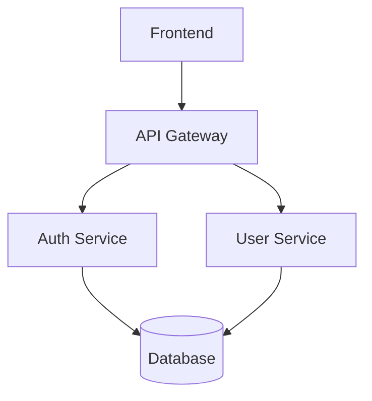
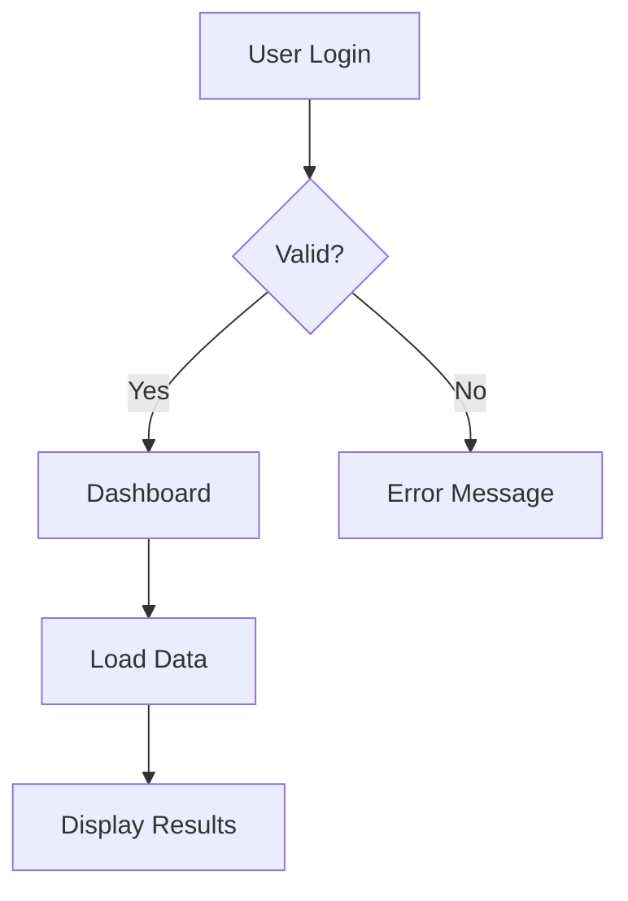
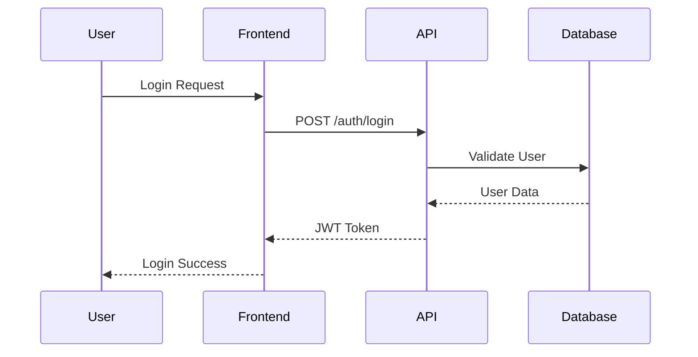

## Context

- Project files: !`fd -t f -e ts -e js -e go . | head -10`
- Package info: !`fd "^(package\.json|go\.mod)$" . | head -3`
- Mermaid CLI: !`which mmdc > /dev/null && echo "available" || echo "not available"`

## Your task

STEP 1: Parse request and determine diagram type

- Extract diagram type from $ARGUMENTS (default: architecture)
- Valid types: architecture, flow, sequence, class, entity
- Extract scope/focus area if provided

STEP 2: Analyze codebase structure

- Identify main components and directories
- Find service boundaries and API layers
- Locate key files and entry points
- Map relationships between components

STEP 3: Generate Mermaid diagram

FOR architecture diagrams:

- Show main components and their relationships
- Include data flow and dependencies
- Group related services together

FOR flow diagrams:

- Map user interactions and system responses
- Show decision points and error handling
- Include authentication and authorization flows

FOR sequence diagrams:

- Show interactions between actors/services
- Include timing and message flow
- Add error conditions and alternatives

STEP 4: Export diagram (if requested)

- Save Mermaid code to file
- IF mmdc available:
  - Generate PNG: `mmdc -i diagram.mmd -o diagram.png`
  - Generate SVG: `mmdc -i diagram.mmd -o diagram.svg`

## Example Outputs

### Architecture Diagram



### Flow Diagram



### Sequence Diagram



## Output Format

```markdown
# Diagram Title

## Overview

[Brief description of what the diagram shows]

## Diagram

[Mermaid diagram code]

## Key Components

- **Component A**: Description
- **Component B**: Description

## Notes

- [Important architectural decisions]
- [Key relationships and flows]
```
