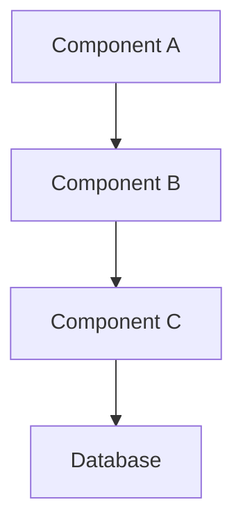

# Design Document

## Overview
High-level description of the feature and its integration with the existing system.

## Architecture

### System Architecture


### Component Interaction
Description of how components interact with each other and existing system components.

## Components and Interfaces

### Component 1: [Name]
**Purpose:** What this component does

**Responsibilities:**
- Primary function
- Secondary functions

**Interface:**
```typescript
interface ComponentInterface {
  method1(param: Type): ReturnType;
  method2(param: Type): Promise<ReturnType>;
}
```

**Dependencies:**
- External dependencies
- Internal dependencies

### Component 2: [Name]
**Purpose:** What this component does

**Responsibilities:**
- Primary function
- Secondary functions

**Interface:**
```typescript
interface AnotherInterface {
  property: Type;
  method(input: InputType): OutputType;
}
```

## Data Models

### Data Structure 1
```typescript
type DataModel = {
  id: string;
  property1: string;
  property2: number;
  createdAt: Date;
  updatedAt: Date;
};
```

**Validation Rules:**
- Field validation requirements
- Business rule validation
- Data integrity constraints

### Database Schema
```sql
CREATE TABLE example_table (
  id UUID PRIMARY KEY,
  property1 VARCHAR(255) NOT NULL,
  property2 INTEGER,
  created_at TIMESTAMP DEFAULT NOW(),
  updated_at TIMESTAMP DEFAULT NOW()
);
```

## API Design

### Endpoints
```
GET /api/resource
POST /api/resource
PUT /api/resource/:id
DELETE /api/resource/:id
```

### Request/Response Format
```typescript
// Request
type CreateRequest = {
  property1: string;
  property2: number;
};

// Response
type ApiResponse<T> = {
  data: T;
  message: string;
  success: boolean;
};
```

## Error Handling

### Error Types
- Validation errors
- Business logic errors
- System errors
- External service errors

### Error Response Format
```typescript
type ErrorResponse = {
  error: {
    code: string;
    message: string;
    details?: any;
  };
  success: false;
};
```

### Error Handling Strategy
- Client-side error handling
- Server-side error logging
- User notification approach

## Security Considerations

### Authentication
- Authentication method
- Token management
- Session handling

### Authorization
- Permission model
- Role-based access control
- Resource-level permissions

### Data Protection
- Input validation
- Output sanitization
- Sensitive data handling

## Testing Strategy

### Unit Testing
- Component testing approach
- Mock strategies
- Coverage requirements

### Integration Testing
- API testing
- Database integration
- External service integration

### End-to-End Testing
- User workflow testing
- Cross-browser testing
- Performance testing

## Performance Considerations

### Optimization
- Database query optimization
- Caching strategy
- Resource management

### Monitoring
- Performance metrics
- Error tracking
- User analytics

## Implementation Notes

### Development Approach
- Implementation phases
- Technical debt considerations
- Refactoring opportunities

### Migration Strategy
- Data migration requirements
- Backward compatibility
- Rollback procedures